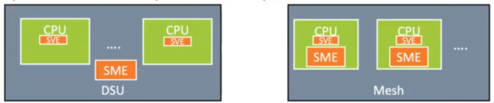
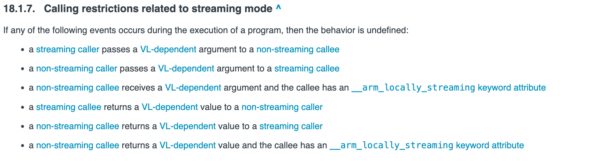
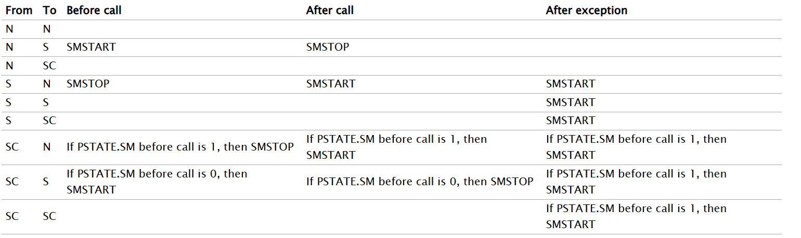
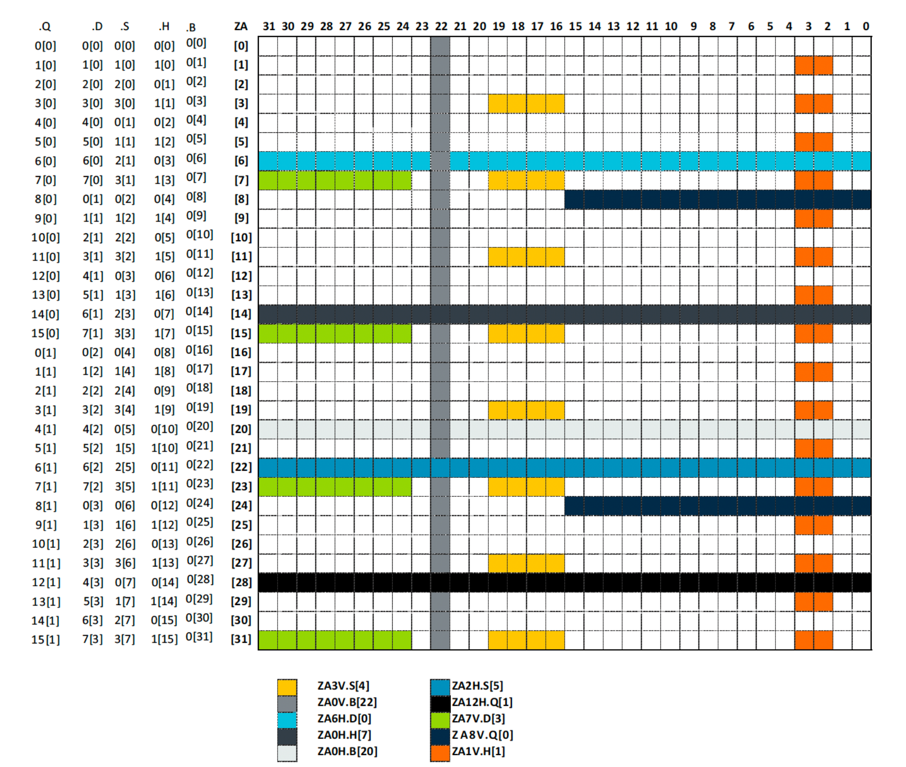
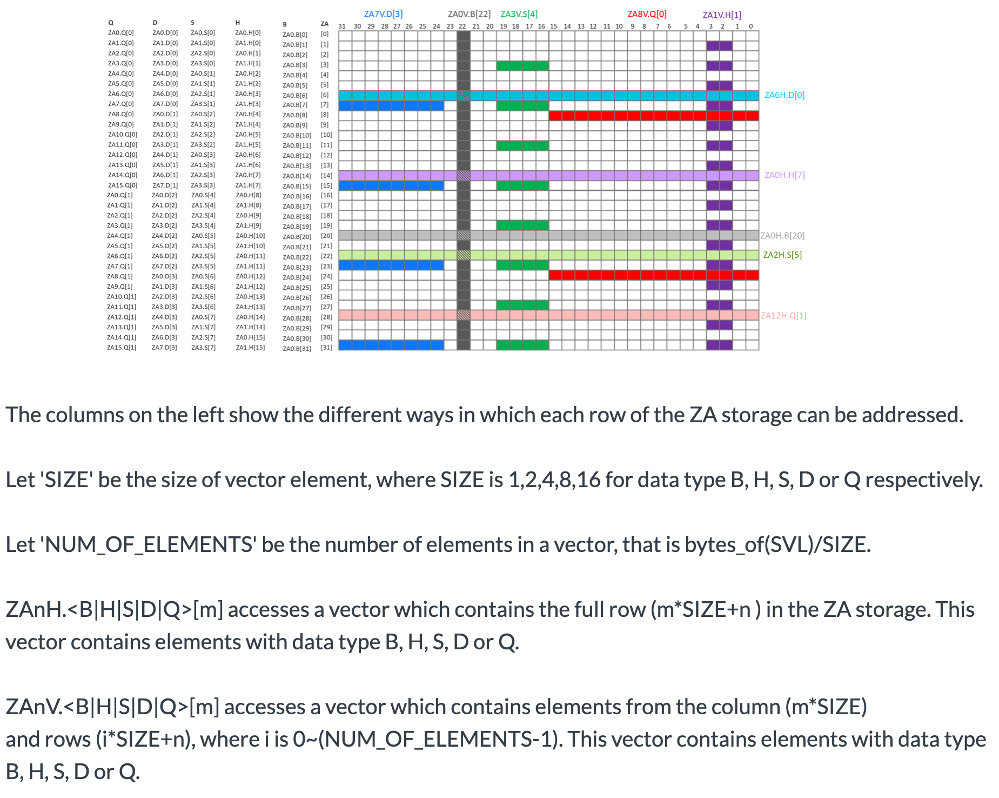

# <u>S</u>calable <u>M</u>atrix <u>E</u>xtension

## Introduction

SME is Arm's architecture extension that provides optimal support for matrix operations that is crucial in AI workloads. The key features that comes in SME are:
- Streaming SVE mode
- Matrix multiplication / outer product between two vectors
- Matrix "tile" storage
- Manipulate data (load, store, insert) in tiles


## Streaming SVE

### Concept

SME introduces two fundamental concepts of "Streaming mode" and "ZA storage" that are crucial to operate on AI workloads. 

To understand the "Streaming mode", let us revisit some background about Scalable Vector Extension (SVE).
The SVE1 and SVE2 introduced the concept of "scalable vector registers". The size of these register or in other words, vector length (VL) can vary between 16B ~ 256B, depending on the hardware vendor. For e.g. Microsoft Azure's Cobalt offering the VL as 16B, Amazon AWS's Graviton3 has 32B while Fujitsu A64FX's Fugaku supercomputer has 64B vector length. During compilation, the VL can be known by querying the OS APIs (JIT) or by specifying the target hardware's VL upfront (AOT). Let us call the VL in SVE1/SVE2 as "non-streaming VL" or NSVL. SME introduces the concept of "streaming mode" where a program can execute in an environment in which the VL can be different than NSVL. The VL in streaming mode is typically referred as Scalable Vector Length or SVL. Since Arm architecture allows SVE1/SVE2/SME features to be available as part of same hardware, it means at one point, a program can be operating on a NSVL, while other times, it can be operating on SVL. There are instructions to turn the streaming mode ON/OFF. To add to the complexity, SME core is a separate unit on a chip (and hence is allowed to have different VL), some SVE1/SVE2/NEON instructions are invalid when the program is running in "Streaming mode". Much care is needed to ensure that developer is not executing non-streaming code while streaming mode is ON. 

SME introduces the concept of "streaming mode". A program can enter or leave streaming mode via the `SMSTART`/`SMSTOP` instructions. Most other SME instructions can only be run inside streaming mode. In all current implementations, the SME core is a separate unit on a chip which is switched to when entering streaming mode. Since this is a separate unit, the VL can be different than NSVL. The VL in streaming mode is typically referred as Scalable Vector Length or SVL. In addition, some SVE1/SVE2/NEON instructions are invalid when the program is running in "Streaming mode".

Since Arm architecture allows SVE1/SVE2/SME features to be available as parts of the same hardware, it means at one point, a program can be operating on a NSVL, while other times, it can be operating on SVL. Much care needs to be taken to ensure that non-streaming code does not get executed when streaming mode is ON. 


Image credit: https://www.youtube.com/watch?v=jrniGW_Hzno

`FEAT_SME_FA64` feature, if present will have SME unit on the CPU itself (configuration on the right) and hence no instructions become illegal, but it might not get implemented for server SKUs because of space it takes on the silicon for SME unit on every core. This needs confirmation though from Arm. That leaves us with the option of shared SME for all or portion of CPUs (configuration on the left) and that might be more for PC, laptop, mobile devices. M4 is the only production ready device, but that just have SME and no SVE feature.

The standard SME setup is one shared SME unit between all or subset of CPUs (configuration on the left). That is aimed more for PC, laptop, and mobile devices. M4 is the only production ready device - that just has SME and but no SVE features in the main CPU cores.

The second concept that SME introduces is `ZA storage` which is a 2D matrix of size `N x N`, where `N` is SVL (Note: it is SVL and not NSVL). This matrix is only available in streaming mode and the instructions to read/write/manipulate the ZA storage need to be executed in streaming mode. Just like NEON registers or Scalable registers, the contents of ZA storage matrix can be interpreted as 1-byte `B`, 2-bytes half `H`, 4-bytes single `S`, 8-bytes double `D` or 16-bytes quad `Q`.

### Terminology

- Non-streaming mode: Default execution
- Streaming mode: PE is set to be in streaming mode after `SMSTART` instruction and before `SMSTOP` instruction is executed for that thread.
- NSVL: Non-streaming Vector Length. Length of vector when program is operating in non-streaming mode.
- SVL: Streaming Vector Length. Length of vector when program is operating in streaming mode.
- VL-dependent objects: Objects whose size is different in streaming vs. non-streaming mode.

## Streaming mode

The processor can be in streaming mode or in non-streaming mode. Switching the PE to/from streaming mode has two outcomes:
- The length of SVE vectors and predicates switches. `NSVL` for non-streaming mode, `SVL` for streaming mode.
- Some instructions can operate only in streaming mode, referred to as "streaming instructions", while some can operate only in non-streaming mode, referred to as "non-streaming instructions". Finally, some can operate in either of the two modes and referred as "streaming compatible instructions".

A program is invalid and will have undefined behavior if "streaming instructions" are run in non-streaming mode or vice-versa.


## C++ ACLE

### Streaming and Non Streaming functions

<i>In C++, changes of mode are automatic based on whether a function is a streaming or non-streaming function. It is the compiler’s responsibility to insert the necessary instructions. There are no C++ intrinsics that map directly to `SMSTART` and `SMSTOP`.</i>

C++ defines function attributes `__arm_streaming` which says that everything in this function should be streaming instructions only and `__arm_streaming_compatible` which says that it only uses the subset of instructions that are valid in both streaming and non-streaming modes. By default (if no attribute is specified), a function is considered to be a non-streaming mode function.



It is the responsibilty of the caller to ensure the SME state is correct before function entry and then restore prior state after exit. The callee always assumes SME state is valid on entry.

If there is a function call from streaming to non-streaming, or from non-streaming to streaming the compiler should inject the required `SMSTART` and `SMSTOP` instructions around the call. When calling streaming and non-streaming functions from streaming compatible functions, the compiler injects code to check the current SME state and switch if required. When calling streaming compatible functions the compiler never needs to check or change modes.



Let us take a look at [this example](https://godbolt.org/z/hxehqv6eG). 

The code can be summarised as:
```c++
extern void n_extern_func(void);
extern void s_extern_func(void) __arm_streaming;
extern void sc_extern_func(void) __arm_streaming_compatible;

void n_sme_func(void){
    n_extern_func();

    // Injected by compiler: SMSTART
    s_extern_func();
    // Injected by compiler: SMSTOP

    sc_extern_func();
}

void s_sme_func(void) __arm_streaming{
   // Injected by compiler: SMSTOP
   n_extern_func();
   // Injected by compiler: SMSTART

   s_extern_func();

   sc_extern_func();
}

void sc_sme_func(void) __arm_streaming_compatible{
    // Injected by compiler: bool sme_state = __arm_sme_state();
    // Injected by compiler: if(sme_state) SMSTOP
    n_extern_func();
    // Injected by compiler: if(sme_state) SMSTART

    // Injected by compiler: bool sme_state = __arm_sme_state();
    // Injected by compiler: if(!sme_state) SMSTART
    s_extern_func();
    // Injected by compiler: if(!sme_state) SMSTOP

    sc_extern_func();
}
```

Note how the SME state is changed before and after calls to the external functions.

## ABI

### Saving / Restoring registers

When entering and leaving streaming mode, all Z and P registers are trashed
<i>
  - When entering Streaming SVE mode (PSTATE.SM is changed from 0 to 1) or exiting Streaming SVE mode (PSTATE.SM is changed from 1 to 0), all of these registers are set to zero.
  - Some SVE2 instructions become illegal to execute in Streaming SVE mode:
    - Gather/scatter load/store SVE2 instructions 
    - SVE2 instructions that use First Fault Register 
    - Most NEON instructions become UNDEFINED
</i>

Let us look at another example [here](https://godbolt.org/z/84Ebrcn5q).

- `z8~z23` and `p4~p15` are saved/restored before streaming mode state changes. The incurs significant performance penalty and hence changing streaming state frequently is not advisable.


## .NET Runtime use cases

SME is suitable for a number of PC/laptop use cases.

- Used to accelerate Tensor
Tensor uses lots of matrix manipulation. These could be simplified by using `Za` in SME.

- Acceleration for existing SVE routines
Arm hardware today is restricted to 128bits. SME implementations generlaly implement wider vector lengths.
Any routines written in SVE could be easily modified to run in streaming mode. This assumes the routine only uses APIs valid in streaming mode. This would give a performance boost due to the wider vector lengths.

- Other AI inference

- Any other workloads requiring large matrix manipulation.

SME is not of use in server scenarios due to it not being available on sever hardware.


## .NET Runtime design

To add the SME support in .NET Runtime, there are lot of considerations that need to be evaluated, out of which the primary ones are:

- Switch streaming state automatically
- Runtime aspects
  - Agnostic VL in code generator
  - Exception Handling
  - Threads and SME state
  - NativeAOT and crossgen2 handling
  - .NET <--> PInvoke/System calls
  - Debugger and Profiler
  - Testability
- Surfacing `ZA` storage using .NET APIs, if there is a need (which is unlikely).

Let us walk through each of the above points in depth.

### Streaming state change

As described above, C++ ACLE defines function atttributes like `arm_streaming` and `arm_streaming_compatible`. These attributes eases the compiler to decide if it needs to turn streaming mode ON or OFF. To support SME in .NET, we need to develop an ability to switch between streaming states, either automatically by the compiler itself or provide that control to the .NET developer. Let us go over some of the options we can make it happen and their pros and cons.

#### 1. MethodAttribute

The first option to be considered would be to do something similar to what ACLE proposes for C++ code. Introduce a method attributes `[SME_Streaming]` and `[SME_Streaming_Compatible]` corresponding to `arm_streaming` and `arm_streaming_compatible` respectively. Having these method attributes, user can use them on methods that will have contain the code related to SME and streaming.

The Code generator can inspect these attributes and accordingly add relevant streaming state change instructions at appropriate places in caller of such methods, if applicable. In below example, streaming state change is inserted in `Bar()` method for calling non-streaming `Baz()` method from it.

The Code generator could also optimize the number of times it need to change between streaming states as seen in `Baz()`, a non-streaming method below. Instead of switching state twice, first for `Foo()` and then for `Bar()`, it would do it just once. Although note that this is not done today for C++ in Clang at the highest optimisation level.

A method that has `[SME_Streaming_Compatible]` will insert streaming state change instructions if the current state is not in the desired streaming state expected by the callee. In  `CompatMethod()`, we see the check that would be inserted by the code generator before calling `Foo()` or `Baz()`. Moreover, the caller of such methods do not have to add the streaming state change instructions before and after the call, because compatible methods will do it for them, as just described.

Care has to be taken by the code generator while inlining streaming method in a non-streaming method and vice-versa. By adding required streaming state instructions at corresponding places, it should be possible to let inlining happen cross streaming method states.
Lastly, while compiling streaming methods for target that does not have SME support, `throw PlatformNotSupportedException` can be inserted at the top of the method.

With this model, all SME intrinsic APIs will be marked as `[SME_Streaming]` and all the SVE/SVE2 APIs that work in streaming mode too, will be marked as `[SME_Streaming_Compatible]`. Calling `[SME_Streaming_Compatible]` intrinsic APIs from a non-streaming methods, will not incur any streaming state change penalty and hence existing .NET libraries code, that use SVE APIs will not get impacted.

```c#
[SME_Streaming]
void Foo() 
{
  ...
}

[SME_Streaming]
void Bar() 
{
  ...
  // insert SMSTOP
  Baz();
  // insert SMSTART
  ...
  CompatMethod();
  ...
}

void Baz() 
{
  ...
  // insert SMSTART
  Foo();
  Bar();
  // insert SMSTOP
  ...
  CompatMethod();
  ...
}

[SME_Streaming_Compatible]
void CompatMethod()
{
  // insert if (PSTATE.SM == STOP) SMSTART
  Foo();
  ...
  // insert if (PSTATE.SM == START) SMSTOP
  Baz();
  ....
}
```

Pros:
- Having method attributes on a method will help code generator to insert accurate streaming state-change instructions at the required locations. Without such *hints* provided, the code generator's job will be difficult trying to guess and estimate the right location of inserting streaming state-change instructions. If the placement of such instructions is incorrect, then the best case scenario could be that we can see performance hit. This can happen when a state-change is not required, but code generator generated one. Since state-change instruction is expensive because it need to save/restore lot of registers, it will take a hit on performance. The worst case scenario of adding streaming state change instructions in wrong places can lead to executing a non-streaming instruction while the PE is set to be in streaming mode or executing a streaming instruction while the PE is NOT in streaming mode. Both of those can cause fault and crash the process. Having a method attribute makes the job of code generator easier.
- With a method attribute for streaming, .NET developer can clearly design their application and encapsulate the streaming specific logic in a dedicated method.
- As mentioned above, it is undefined behavior passing VL-dependent objects between methods of different streaming states. By having a method attribute, we could have a static analyzer that will check for such mistakes done by developers. To ease the job of analyzers, SME or streaming compatible intrinsics can be moved into its own namespace like `System.Runtime.Intrinsics.Arm.Sve.Streaming` and if a method not marked with `[SME_Streaming]` has any API from this namespace, analyzer can point out the errors to user.
- There can be occurances where .NET developer forgets to add/remove the method attributes. Let us explore two situations that can arise:
  - a. A developer should have added `[SME_Streaming]` attribute on method `A()`, but forgets to add one. In such case, code generator will treat `A()` as non-streaming method and will insert streaming state change instruction if there is: (1) SME intrinsic API or (2) Call to a method marked with `[SME_Streaming]`.
  - b. A developer should have removed `[SME_Streaming]` attribute from method `A()` because it no longer holds any streaming related code, but forget to do so. Such methods will continue to get treated as streaming methods and streaming-state change instruction will be added for entire code in the method. Several `SMSTOP, non-streaming code, SMSTART` can be batch combined by code generator to have just one `SMSTOP` at the beginning of the method and one `SMSTART` at the end of method. Note, this will be needed because the caller will see `A()` as streaming method and will add `SMSTART` before calling `A()` and `SMSTOP` after call is done.
  The take away from this is that with the presence of information of streaming state in which a method is supposed to run, code generator can much easily add the required streaming state instructions, even if the information is inaccurate or outdated sometimes.
- Existing libraries methods invocation (streaming or non-streaming callees)  can be made easily from streaming or non-streaming callers without having to think the streaming mode of the target method being invoked.

Cons:
- .NET developer wrongly puts or forgets to put the streaming attribute on a method. We have already seen above that this should not affect the correctness characteristics, but can affect performance of the methods.
- Although we called out that static analyzers can be used to identify errors made by developers by passing VL-dependent objects between different streaming state methods, lot of projects might turn off static analyzers and for them, the behavior in such scenario is undefined. We could still utilize the method attribute information to analyze if VL-dependent arguments are passed or returned and add `throw InvalidProgramException` or something similar.

There are few considerations with these options regarding some of the optimizations:
1. Inlining must be disabled when callee is part of different streaming mode.
2. Tail call optimization must be disabled when the callee is part of different streaming mode.

#### 2. Expose StreamingON() and StreamingOFF()

Alternate approach to method attributes is exposing streaming state change instructions as intrinsics like `StreamingON()` and `StreamingOFF()`. This will allow developers to drive the streaming mode and code generator will just insert corresponding instructions at relevant places in the code.

Pros:
- The benefit of exposing these as .NET intrinsics is that developer have fine grain control over the places in their code where they want to start and stop streaming.
- .NET developers workflow remains same (unlike #1 above, where they had to add an attribute on the method).
- No work needed for code generation in analyzing the placement of streaming state change instructions. The only thing that code generator would be responsible for is tracking the registers that should be saved and restored before/after the invocation of these intrinsics.

Cons:
- This option, however, gives lot more power to .NET developers than needed, and there are high chances that it can go wrong easily. For example, they can have `StreamingON()` and unknowingly write code that generates NEON instructions, while streaming is ON. This can cause fault and crash their process.
- Just like method attributes case, developers can forget to call one of these intrinsics and that can result in catastropic failure. While in case of method attributes scenario, code generator would protect the code by adding appropriate streaming state change instructions, nothing of that sort will happen for this option. Not only the code will be performance ineffecient but will also led to crashes - calling an SME API that is only valid in streaming mode would cause an illegal instruction exception at runtime.
- Even if the developer is careful in adding `StreamingON()` and `StreamingOff()` APIs, there will be just too many of them scattered around in the code and they will have to remember what the mode is at the point of writing their code to make sure counterpart API is called. 
- Sometimes, we could also see code like and there is no way to flag such errors to users.
  ```c#
  StreamingOn();
  ...
  if (condition)
  {
    StreamingOff();
  }
  ...
  StreamingAPI(); // is this valid?
  StreamingOff();
  ```
- Accessing VL-dependent objects that crosses streaming state will remain unsolved with this approach.
  ```c#
  Vector<int> a = ... // NSVL
  StreamingOn();
  ... = a;        // undefined
  StreamingOff();  
  ```
- Calling functions whilst in streaming mode adds additional complexity for the user to track. The user will not know which library routines are safe to call whilst in streaming mode. Is it safe to call `System.Console.WriteLine()` whilst in streaming mode?

#### 3. RAII style `using`

Another option to expose the streaming state change would be to give it "Resource Acquisition is initialization" semantics or RAII. To do that, we can introduce a placeholder class in `System.Runtime.Intrinsics.Arm.Sve` called `StreamingMode`. The lifetime of this class will dictate the entering and leaving of streaming mode.

```c#
using (StreamingMode m = new StreamingMode())
{
  // streaming logic
}
```

Pros:
- This approach is simpler to use and provides natural intent of executing streaming instructions in scoped block.

Cons:
- With this approach, calling .NET libraries method of different streaming mode becomes difficult.

  ```c#
  void Foo() // non-streaming
  {
      using (StreamingMode m = new StreamingMode())
      {
        // streaming logic
        Bar();  // non-streaming method
        // streaming logic
      }
  }
  ```

- Just as mentioned in streaming state change intrinsics approach, accessing VL-dependent objects created from outside the streaming scope will be undefined.

  ```c#
  Vector<int> a = ...  // NSVL
  using (StreamingMode m = new StreamingMode())
  {
    // streaming logic
    .. = a; // undefined
  }
  ```

- The .NET developer can forget to add the RAII around streaming code or forget to remove RAII around code that previously had streaming but not currently. In both cases, it can lead to crashes in the program when executing incompatible instructions. Since such code is syntantically and semantically correct, the C# compiler will not flag such errors.

- This approach can be extended by the code generator to make it similar to approach #1. The code generator will see if the non-streaming code is getting invoked from streaming scope and can generate appropriate streaming state change instructions. However, it might be hard to do it other way round, if the users forget to enclose the streaming logic with `StreamingMode()`.

#### 4. Hybrid approach

A hybrid approach may be possible. The SME APIs would be marked with `[SME_Streaming]` and `[SME_Streaming_Compatible]`, but generally this would not be added to user methods and it would not cause the compiler to insert mode changes. .NET developers would either use the StreamingON() and StreamingOFF() or StreamingMode RAII method in their code. At JIT compile time, if methods marked with attributes are used in a function, then the compiler can check if the current mode is in the correct mode.

Pros:
- The compiler can error safely instead of getting an illegal instruction at runtime

Cons:
- The approach is confusing as to when the attributes can be used.
- It may be difficult to ensure all error cases are captured correctly.


#### 5. Code generator tracks SM state

Instead of relying on the developer to specify places where streaming mode should be changed, code generator can take the heavy burden of tracking it implicitely. It can then also be made responsible for injecting appropriate streaming state change instructions at right place. Every time we see a call to SME intrinsics, `SMSTART` can be inserted and after that, `SMSTOP`. Several of these state changing instructions can be combined and performed in batch.

Pros:
- No method attributes or RAII or any specicial intrinsics is needed for this to work. The logic is abstracted away from .NET developer and there is no change in the workflow of developer writing their streaming/non-streaming code.

Cons:
- The problem of what happens when VL-dependent objects are created in non-streaming and accessed in streaming remains unsolved. Code generator can add `throw InvalidProgramException` at such points, if it can prove that the object is VL-dependent and was created in non-streaming mode (or vice-versa), but it can be easily missed out.
- Mistakes in injecting streaming state change instructions at right places can not only cause correctness issues, but also crashes.
- With various optimizations, we might end up injecting streaming start in a branch, but do not add corresponding stop. This can lead to undefined behavior or crash the program.
- Calling non-SME code in between SME intrinsic calls will result in the state switching even though is not required resulting in performance loss:

  ```c#
  // Streaming mode started
  SME.method1();
  // Streaming mode stopped
  x = x + 1; // This could have been run in streaming mode
  // Streaming mode started
  SME.method2();
  // Streaming mode stopped
  ```

### Code generation for Agnostic VL

`Vector<T>` is the .NET's representation of vectors, whose length is known only at runtime. It's length represents non-streaming VL (NSVL) that was added as part of SVE feature in .NET 9. It's length will be represented as streaming VL (SVL) when program is running in SME. To support SME feature, .NET's code generator has to be updated to understand the semantics of dynamic (NSVL) and unknown (SVL) vector length. Further, the code generated should also take the streaming mode into account.

To understand why it is important, let us take a simple example of `bool a = Vector.GreaterThanAll(b, c);`. Here, `b` and `c` are of type `Vector<float>`. The code checks if values in all lanes of `b` are greater than corresponding values of `c`. We will use `fcmgt` instruction that does the comparison and stores `1` in corresponding lanes of predicate register for which the condition matches. After that, we just need to check if all lanes of predicate registers are active to return true or false.

In NSVL, where VL is fixed, we can compare the active lanes of predicate register with a "constant". In below assembly code, it is `#8`, assuming we are producing code for target, where VL=32.

```asm
    fcmgt   p0.s, p0/z, z8.s, z0.s  # Activate p0 lanes for which z8 > z0
    ptrue   p1.s                  
    cntp    x0, p1, p0.s            # Count number of active lanes   
    cmp     x0, #8                  # If all 8 lanes are active means all
    cset    x0, eq                  # lanes satisfied z8 > z0
```

However, if VL is not known during compilation or if we are executing in streaming mode, where VL can change, we cannot embed the VL value `#8` in the generated code. It has to use more sophisticated method of finding that value and then comparing the active lane count against that like `rdvl` instruction.

```asm
    fcmgt   p0.s, p0/z, z8.s, z0.s  # Activate p0 lanes for which z8 > z0
    ptrue   p1.s                  
    cntp    x0, p1, p0.s            # Count number of active lanes   
    rdvl    x1, #4                  # Get count of 4-byte lanes
    cmp     x0, x1                  # If all 8 lanes are active means all
    cset    x0, eq                  # lanes satisfied z8 > z0
```

For a simple example above, we can see the code generated should be different based on if VL is known during compilation or not. Depending on the circumstances under which we are compiling a method, we might or might not know VL. As such, we need to design a strategy of generating correct and optimal VL agnostic code.

#### Partial VL agnostic code

In scenarios, where VL can be known during compilation (JIT) and it stays the same throughout the execution of the method getting compiled (non-streaming), we can take advantage of the VL size information in various optimization heuristics and code generation. As seen in the example above, if we know that VL= 32 bytes, we can embed the "4-byte lane count" constants in the target code, because the VL information will not change at that point in the program. I refer to this mode as "partial" VL agnostic code, because although, we will use scalable VL agnostic registers and instructions, we also make use of the VL information that we have during compilation.

Here are some of the things that will be done, in "partial" VL agnostic mode:

- Dependency on VL size can be taken and the size can be embedded in the generated code. (see above example).
- Value numbering can pick the appropriate `simd*_t` to represent constant data `Vector<T>` holds and can assign VN to them.
- Code to load constant data from RO section into `Vector<T>` is allowed because we would know exactly how many bytes can be loaded using SVE `ldr` instruction and how many residual bytes should be loaded by NEON/scalar instructions.
- VL variables can be present in "local" area of stack frame and no special placement is needed for them. They will be accessed using SVE's [load](https://docsmirror.github.io/A64/2023-06/ldr_z_bi.html)/[store](https://docsmirror.github.io/A64/2023-06/str_z_bi.html) VL-agnostic instructions.
- Stack size can be calculated upfront and frame size can be embedded in the code even if `Vector<T>` variables are saved on stack.
- Other optimizations that takes Vector length in consideration like loop unrolling, struct block copy, etc. can be lighten up.

In code generator, we use `TYP_SIMD*` types to represent the types of vector values involved. For Arm64 target, valid values are `TYP_SIMD8` and `TYP_SIMD16`, that represents 8/16 bytes vector respectively. For x86 target, there are `TYP_SIMD16`, `TYP_SIMD32` and `TYP_SIMD64` to represent 16/32/64 bytes vectors respectively. For SVE, valid vector types are: `TYP_SIMD16`, `TYP_SIMD32`, `TYP_SIMD64`, `TYP_SIMD128` and `TYP_SIMD256`. For partial VL agnostic mode, we will repurpose the existing `TYP_SIMD32` and `TYP_SIMD64` of x86 and define 2 new types i.e. `TYP_SIMD128` and `TYP_SIMD256`. With that, we can reuse lot of the code and specially optimizations that are already present for Arm64 and x86. There is less code churn with that route. In partial agnostic VL mode, the size of `Vector<T>` will determine the type of `TYP_SIMD*` to be assigned to the `GenTree*` nodes.

#### Full VL agnostic code

In scenarios, where VL cannot be known during compilation (ahead of time compilation) or once known, can be different during the execution of the method (streaming). We cannot make any assumptions on the VL i.e. `Vector<T>` size information and cannot use it in optimization heuristics or targetted code. We will use a type `TYP_SIMDVL` for such variables and have `-1` size to it to indicate that size is unknown during compilation. The generated code should be fully agnostic to VL. It should not have any traces of dependency or assumptions about the VL. Hence, I refer this "fully" VL agnostic code.

In "full" VL agnostic mode, following things will be prohibited for now. It may be possible to enable some or all of the optimizations, but we will leave it as lower priority and get to it, when other tasks for agnostic VL is done and we are confident that it works.
- Dependency on VL size and embedding in code is not possible because it is not known during compilation time. Wherever there is a need to get VL size, instruction like `rdvl` will be used to poll the vector length (See example above).
- If VL is not known during compilation, we won't be able to represent and store those constants in `simd*_t` of  valnue numbering. As such, value numbering will not be able to compare two `Vector<T>` values. Hence, we will assign `NoVN` for them and they won't be able to participate in further optimizations based on value numbering. For cases where constant data needs to be populated in vectors, the existing mechanism of NEON `Vector128` will be used.
- We cannot have VL variables in the "locals" sections in full VL agnostic mode. If we have it such, the offsets of other non-VL locals will be unknown and we will not be able to access those variables from frame using fixed offset. Hence, such VL variables need to be present at the bottom of stack frame, batched together. They will be then referenced by using [load](https://docsmirror.github.io/A64/2023-06/ldr_z_bi.html)/[store](https://docsmirror.github.io/A64/2023-06/str_z_bi.html) VL-agnostic instructions.
- If VL variables are present on the stack, the stack size cannot be calculated during compilation. In that case, instruction like [addvl](https://docsmirror.github.io/A64/2023-06/addvl_r_ri.html) will be used to create the stack frame.
- Other optimizations that takes Vector length in consideration like loop unrolling, struct block copy, etc. will be disabled.

#### Partial -> Full VL agnostic code

For crossgen2 scenarios, where we do ahead of time compilation without knowning the VL, but then re-compile methods, when VL can be found out, we can use "partial->full" agnostic VL code generation technique. What that means is, during AOT compilation, we will generate "full" agnostic VL code. During execution, when we rejit those methods, we will use the partial VL agnostic code, whenever applicable.

#### Summary

To summarize, the VL agnostic code generation is about two properties:
1. Can we find out VL up-front during method compilation?
2. If yes, will the VL stay the same during execution of the portion of code that is getting compiled?

Here is snapshot of VL agnostic code mode that will be used for various scenarios.

| Scalable Mode | Method type   | Code generation mode  | VL agnostic code  |
|---------------|---------------|-----------------------|-------------------|
| SVE           | non-streaming | JIT                   | partial           |
| SVE           | non-streaming | NativeAOT             | full              |
| SVE           | non-streaming | crossgen2             | full -> partial   |
| SME           | non-streaming | JIT                   | partial           |
| SME           | non-streaming | NativeAOT             | full              |
| SME           | non-streaming | crossgen2             | full -> partial   |
| SME           | streaming     | any                   | full              |

#### Vector<T> intrinsics

Traditionally, the `Vector<T>` methods on Arm64 are mapped to corresponding methods of `Vector128` in IR and that way, NEON instructions are produced with 16-byte SIMD registers. With SVE and SME, we will continue to retain the `Vector<T>` methods in IR nodes and this will hint us to produce SVE/SME code using scalable registers. We will only enable the mapping of `Vector<T>` to scalable concept if underlying `VL > 16`, because when `VL==16`, NEON instructions are similar or faster compared to SVE instruction set.

### Restricting VL-dependent objects transfer between streaming states

If we chose option# 1 of using method attributes like `[SME_Streaming]`, code generator should be able to validate if arguments or return results of such method is VL-dependent objects and if yes, it will add a code to `throw InvalidProgramException` at the start of the method. There can be several scenarios in which VL-dependent objects may cross boundary between streaming states. Simplest one is `static Vector<T>` variable `a` can be accessed in streaming method. If we prefer some other options, then we need to rethink on how to enforce such restriction.

### Runtime

Here are some raw notes of various .NET runtime components that need to be handled for SME and need more thinking.

#### Exception Handling
- Saving and restoring of `PSTATE.SM` and `PSTATE.ZA` along with saving and restoring of `ZA` storage space.
- Update unwinder to sync with that of Windows OS to bring in newer unwind codes relevant for SME instructions and `ZA`.

#### Threads
- During process creation, `PSTATE.SM` state is cleared i.e. it starts with non-streaming mode. We can use the same concept when new threads are created.

#### GC
- `Vector<T>` that is on stack can be different depending on the streaming mode that was active when it was saved. When GC scans the object, it needs to know the size of object to scan. Objects already have `size` component in the header, but additional metadata might be needed for VL-dependent objects created in streaming mode to make sure the correct size is read by GC. Correct size information might also be needed in various other components of runtime.
- Need to deeper investigation on if `ZA` storage can hold GC references and if yes, how to make GC scan the storage space.
- When suspended execution threads by GC are resumed, some threads might be in streaming mode while others might not. Need to check if there is any handling that needs to happen to make sure that their modes are restored correctly and they do not accidently execute code in wrong mode.

#### Assembly routines and Stubs
For simplicity, we will not use streaming in hand-written assemblies, but if there is a need, it should ensure to save / restore all the required streaming and ZA states.

#### .NET <--> PInvokes / System calls

Anytime we make calls including but not limited to Pinvokes, JIT helpers, stubs we will have to ensure to save scalable `Z` and predicate `P` registers.


### Debugger / Profiler

- When stepping through a program, processor mode might be different from the one implied by the source code that is being debugged. This can be possible when a different As such, we can encounter crash if the code being debugged executes invalid instruction depending on the streaming mode.

- Another interesting debugging scenario is how does offline debugging or debugging of dumps work. While debugging the dumps, when `SMSTART` instruction is encountered, it cannot execute the code after it on SME unit. As a result the debugger need to save some kind of SSVL information and `PSTATE` information at such points. Debugger during stepping through will read this information and adjust the VL and ZA states accordingly. It might have to also save/restore contents of Z and ZA registers, but it is unclear how it will all connect.

- Appropriate support of displaying the values of `Vector<T>` in debugger should be taken depending on the streaming mode in which they were created. Since VL-dependent objects should not cross streaming mode boundary, such variables should not change their sizes in debugger when streaming type is switched.

- Similarly, since scalable registers operate on different vector length when streaming mode is changed, debugger need to ensure that streaming mode changes are reflected in register contents it displayed. This might be easy for non-UI debuggers, where you need to type the command to display registers. For UI based debuggers, which has register window, the UI need to be refreshed with appropriate VL and its contents displayed.

- Visual Studio, windbg and other debugger tools need to add support for displaying the contents of `ZA` storage space.

- During debugging, it is possible to write the `PC` with instruction like `SMSTART` and `SMSTOP`. When this happen, the impact on the thread being debugged might have severe undefined impact. This is same scenario as inserting `int 3` in the `PC` while stepping through the code during debugging.

## ZA storage space

### Concept

Assuming we have 128-bits / 16B SVL, here is the representation. Treat `n is from 0 thru 15`
- **BYTE**
  - <u>ZA array vector access</u>: The `byte` in ZA, are stored as [16x16] 8-bits elements, thus representing 256 `byte` elements in total. Each row is refered is `ZA.B[n]`, where `n` is a row index. For e.g. when `SVE=16B`, they are `ZA.B[0], ZA.B[1],...,ZA.B[15]`.
  - <u>ZA tile</u>: There is just 1 tile for `byte` and is representated as `ZA0.B`. The horizontal slices (row order) is accessed using `ZA0H.B[n]`. For e.g. in our case, it will be `ZA0H.B[0], ZA0H.B[1],...,ZA0H.B[15]`. Likewise, column major entries are accessed using vertical slices using notation `ZA0V.B[n]`.
- **SHORT**
  - <u>ZA array vector access</u>: The `short` in ZA, are stored as [16x16] 16-bits elements, thus representing 128 `short` elements in total. Each row is refered is `ZA.H[n]`, where `n` is a row index.For e.g. when `SVE=16B`, they are `ZA.H[0], ZA.H[1],...,ZA.H[15]`.
  - <u>ZA tile</u>: There are 2 tiles for `short` and are representated as `ZA0.H` and `ZA1.H`. The horizontal slices (row order) are accessed using terminology `ZA0H.H[n]` and `ZA1H.H[n]`. The access is alternate such that `ZA0H.H[0] => ZA.H[0], ZA0H.H[1] => ZA.H[2]` and so forth. Likewise, `ZA1H.H[0] => ZA.H[1], ZA1H.H[1] => ZA.H[3]`. In general we can formulate it like: `ZAkH.H[m] => ZA.H[2*m+k]`.

    The verticle slices `ZA0V.H[n]` accesses the top 8 rows of `ZA` storage in "column-major" order, while `ZA1V.H[n]` access the bottom 8 rows of `ZA` storage, again, in "column-major" order. They go from `ZA0V.H[0], ZA0V.H[1],..,ZA0V.H[7]` and likewise for `ZA1V.H[*]`.



Image courtsey: Arm documentation for 32B/256-bits SVL. Source: https://developer.arm.com/documentation/109246/0100/SME-Overview/SME-ZA-storage/ZA-array-vector-access-and-ZA-tile-mapping


Image credits: https://community.arm.com/arm-community-blogs/b/architectures-and-processors-blog/posts/arm-scalable-matrix-extension-introduction

### Representation of ZA storage in .NET APIs

ACLE do not expose `ZA` in the API signature. Instead they have one of the following notations on intrinsic APIs:
 - `__arm_in("za")` : The callee takes the `ZA` state as input and returns with the state unchanged.
 - `__arm_out("za")` : The callee ignores the incoming `ZA` state and returns new state.
 - `__arm_inout("za")` : The callee takes the state as `ZA` input and returns new state.

Below is the API for [SMLAL](https://docsmirror.github.io/A64/2023-06/smlal_za_zzi.html) instruction.

```
// SMLAL intrinsic for 2 quad-vector groups.
    void svmla_lane_za32[_s8]_vg4x2(uint32_t slice, svint8x2_t zn,
                                    svint8_t zm, uint64_t imm_idx)
      __arm_streaming __arm_inout("za");

```

We can follow the similar approach and not expose `ZA` storage in .NET APIs. We will map the APIs to the SME instructions during code generation and that will implicitely take care of reading/writing `ZA` state. So for above instruction, we will have API:

```C#
void SvmlaLaneZA32S8_VG4x2(uint slice, Tuple<Vector<byte>, Vector<byte>> zn, Vector<byte> zm, ulong imm_idx);
```

There are various nomenclature rules for API names that depends on if `ZA` is used by the instruction as input state, if it is operating on single lane, etc. The API will append those operations like having `_x2`/`_x4`or `_vg2`/ `_vg4` or `_vg1x2`/`_vg2x2`, etc. We need to follow similar rules for .NET APIs.

Refer: https://arm-software.github.io/acle/main/acle.html#sme-instruction-intrinsics

## Dependencies

- Windows OS
  - Support of SME and context save/restore
  - Unwind codes for SME instructions
- .NET Debugger team
  - Display of `Vector<T>` in streaming and non-streaming modes.
- C++ compiler support
  - If we ever decide to use streaming in C++ runtime code or assembly routines
- Visual Studio  Debugger and windbg

## Testability

- The Intrinsic unit tests that will be added for SME intrinsics should automatically test the switching of streaming modes. We can use [Armie](https://developer.arm.com/Tools%20and%20Software/Arm%20Instruction%20Emulator) to test some of the scenarios around switching streaming mode. Others can be validated on osx-arm64 M4+.
- Coverage will be added in Antigen/Fuzzlyn to create methods that operate on streaming mode and that calls SME intrinsics. We will need osx-arm64 M4+ to get the coverage here for SME intrinsics.
- `superpmi-replay` can be harnessed to produce SME code and verify the encoding and code generation works as expected.


## Hardware to prototype

- Apple's M4
  - The only hardware that has SME, but it does not have SVE, so will be hard to test scenario of switching streaming modes. However, preliminary SME intrinsics will be able to validate.
- Azure Cobalt / AWS's Graviton
  - We can use these hardwares to validate vector agnostic support, which will be the foundation of validating SME.

## Alternative approach - Using Kleidi

Arm understands that SME is complicated and does not expect the average developer to understand all the concepts and edge cases required to write  SME code. Writing performant SME code is even harder. As such, Arm provides the [Kleidi libraries](https://www.arm.com/products/development-tools/embedded-and-software/kleidi-libraries), Kleidi AI and Kleidi CV (computer vision). These libraries are written in C and low level assembly, and are open source on Arm gitlab under the Apache 2 license. They aim to provide provide the most performant versions of common AI and CV routines on Arm hardware, automatically utilising SME when it is available.

A lot of functions in Kleidi CV are simply standard SVE routines running in streaming mode to take care of the extra vector length.

One option would be to wrap Kleidi in a C# wrapper and provide this as an external package on NuGet. It would require regular maintainence, however it may be possible to mostly automate this. To be feasible this would need buy in from both the Arm Kleidi team and the Microsoft CoreCLR team, and an agreement on who owns/maintains the wrapper.

Pros:
- No need for any compiler changes or any large scale work items in CoreCLR.
- The wrapper will be fairly easy to write and maintain when compared to implementing a full SME API.
- Expected good performance immediately.

Cons:
- C# libraries or any code within coreCLR cannot use Kleidi due to the dependency on an external library.
- The library may be missing relevant use cases for C#
- Long term maintenance - what happens if the library is abandoned or simply removed?

This approach could be used as a stepping stone until an eventual SME API is implemented.

## References
- Overview series: 
  - https://community.arm.com/arm-community-blogs/b/architectures-and-processors-blog/posts/scalable-matrix-extension-armv9-a-architecture
  - Arm SME [part 1](https://community.arm.com/arm-community-blogs/b/architectures-and-processors-blog/posts/arm-scalable-matrix-extension-introduction), [part 2](https://community.arm.com/arm-community-blogs/b/architectures-and-processors-blog/posts/arm-scalable-matrix-extension-introduction-p2) and [part 3](https://community.arm.com/arm-community-blogs/b/architectures-and-processors-blog/posts/matrix-matrix-multiplication-neon-sve-and-sme-compared).

- SME instructions: https://docsmirror.github.io/A64/2023-06/mortlachindex.html
- SME kernel docs: https://docs.kernel.org/arch/arm64/sme.html
- LLVM register allocation for `ZA`: https://github.com/llvm/llvm-project/commit/c08dabb0f476e7ff3df70d379f3507707acbac4e


### TODO
- Need to come up with list of SVE instructions that are valid vs. invalid in streaming mode
- Understand ZA storage
- ZA lazy scheme: https://arm-software.github.io/acle/main/acle.html#sme-instruction-intrinsics

### Open Questions
- What happens when `Vector<T>` is created in streaming mode? Can we pass it around to non-streaming mode and vice-versa? 18.1.7 restricts VL-dependent arguments to be passed that way, but how to restrict them in C#?

-------
