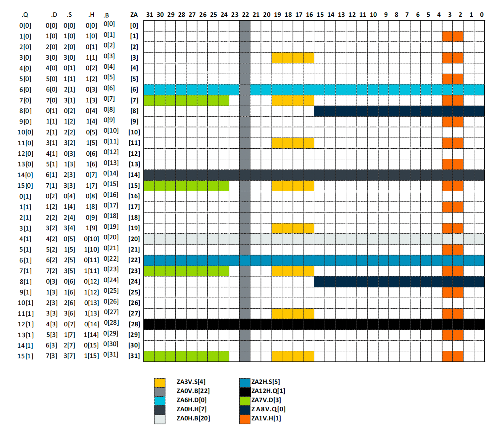

### Notes

## Introduction

## Concepts

### Terminology

- ZA storage space
- SVL vs. NSVL
- SME methods

### Things SME offers

- ZA storage space
- Operating on streaming mode vs. default mode
- VL on streaming mode vs. non-streaming mode

### ZA storage space

- vector arrays and tiles
- explain the concept on how to understand and remember


Assuming we have 128-bits / 16B SVL, here is the representation. Treat `n is from 0 thru 15`
- **BYTE**
  - <u>ZA array vector access</u>: The `byte` in ZA, are stored as [16x16] 8-bits elements, thus representing 256 `byte` elements in total. Each row is refered is `ZA.B[n]`, where `n` is a row index. For e.g. when `SVE=16B`, they are `ZA.B[0], ZA.B[1],...,ZA.B[15]`.
  - <u>ZA tile</u>: There is just 1 tile for `byte` and is representated as `ZA0.B`. The horizontal slices (row order) is accessed using `ZA0H.B[n]`. For e.g. in our case, it will be `ZA0H.B[0], ZA0H.B[1],...,ZA0H.B[15]`. Likewise, column major entries are accessed using vertical slices using notation `ZA0V.B[n]`.
- **SHORT**
  - <u>ZA array vector access</u>: The `short` in ZA, are stored as [16x16] 16-bits elements, thus representing 128 `short` elements in total. Each row is refered is `ZA.H[n]`, where `n` is a row index.For e.g. when `SVE=16B`, they are `ZA.H[0], ZA.H[1],...,ZA.H[15]`.
  - <u>ZA tile</u>: There are 2 tiles for `short` and are representated as `ZA0.H` and `ZA1.H`. The horizontal slices (row order) are accessed using terminology `ZA0H.H[n]` and `ZA1H.H[n]`. The access is alternate such that `ZA0H.H[0] => ZA.H[0], ZA0H.H[1] => ZA.H[2]` and so forth. Likewise, `ZA1H.H[0] => ZA.H[1], ZA1H.H[1] => ZA.H[3]`. In general we can formulate it like: `ZAkH.H[m] => ZA.H[2*m+k]`.

    The verticle slices `ZA0V.H[n]` accesses the top 8 rows of `ZA` storage in "column-major" order, while `ZA1V.H[n]` access the bottom 8 rows of `ZA` storage, again, in "column-major" order. They go from `ZA0V.H[0], ZA0V.H[1],..,ZA0V.H[7]` and likewise for `ZA1V.H[*]`.



Image courtsey: Arm documentation for 32B/256-bits SVL. Source: https://developer.arm.com/documentation/109246/0100/SME-Overview/SME-ZA-storage/ZA-array-vector-access-and-ZA-tile-mapping


Image credits: https://community.arm.com/arm-community-blogs/b/architectures-and-processors-blog/posts/arm-scalable-matrix-extension-introduction

### Function calls

At present, the classification can only be controlled at function granularity: the statements in a function are all
non-streaming, all streaming, or all streaming-compatible. When no attribute specifies otherwise, all statements in
a function are non-streaming. A program is ill-formed if:
- a streaming statement or a streaming-compatible statement contains an evaluated call to a non-streaming
intrinsic.
- a non-streaming statement or a streaming-compatible statement contains an evaluated call to a streaming
intrinsic.

- If any of the following events occurs during the execution of a program, then the behavior is undefined:
  - The program accesses a non-streaming object while the abstract machine is in streaming mode.
  - The program accesses a streaming object while the abstract machine is in non-streaming mode.

<i>In both cases, these changes of mode are automatic and it is the compiler’s responsibility to insert the necessary instructions. There are no intrinsics that map directly to SMSTART and SMSTOP.</i>


### VL in streaming environment

## ABI

When entering and leaving streaming mode, all Z and P registers are trashed
<i>
  - When entering Streaming SVE mode (PSTATE.SM is changed from 0 to 1) or exiting Streaming SVE mode (PSTATE.SM is changed from 1 to 0), all of these registers are set to zero.
  - Some SVE2 instructions become illegal to execute in Streaming SVE mode:
    - Gather/scatter load/store SVE2 instructions 
    - SVE2 instructions that use First Fault Register 
    - Most NEON instructions become UNDEFINED
</i>

## .NET Runtime

### .NET APIs

#### Goal

#### Representation options
- namespace
- MethodAttribute + static analyzer
- Determine during compilation similar to FFR

#### Representation of ZA storage in .NET APIs

Need to come up with various naming strategy depending on if `ZA` is passed and if it is operating on single lane, etc. like having `_x2` or `_x4` suffix or `_vg2` or `_vg4` suffix or `_vg1x2`, `_vg2x2`, etc.

Refer: https://arm-software.github.io/acle/main/acle.html#sme-instruction-intrinsics

[SMLAL](https://docsmirror.github.io/A64/2023-06/smlal_za_zzi.html)
```
// SMLAL intrinsic for 2 quad-vector groups.
    void svmla_lane_za32[_s8]_vg4x2(uint32_t slice, svint8x2_t zn,
                                    svint8_t zm, uint64_t imm_idx)
      __arm_streaming __arm_inout("za");

```

### Exception Handling
- unwinding and what to track
- Care needs to be taken to restore `PSTATE.SM` and `PSTATE.ZA` when exception is thrown and during unwinding.


### NativeAOT
- Applicable for non-streaming as well as streaming

### Threads
- How the state is tracked

### .NET <--> PInvokes

### .NET <--> System calls

### Debugger

- Need to see if streaming mode can change while debugging or if the processor mode might sometimes be different from the one implied by the source code.
- The register or variable display logic in VS/windbg when in streaming vs. not.

### Profile

## Dependencies
- Windows OS
  - Support of SME and context save/restore
  - Unwind codes and exception handling
- .NET Debugger team
- VC++ support (?)
- VS Debugger

## Hardware to prototype
- Apple's M4: Currently have SME but does not have SVE.
- Azure Cobalt / AWS's Graviton: Validate vector agnostic support

## References
- Overview series: 
  - https://community.arm.com/arm-community-blogs/b/architectures-and-processors-blog/posts/scalable-matrix-extension-armv9-a-architecture
  - https://community.arm.com/arm-community-blogs/b/architectures-and-processors-blog/posts/arm-scalable-matrix-extension-introduction

- SME instructions: https://docsmirror.github.io/A64/2023-06/mortlachindex.html
- SME kernel docs: https://docs.kernel.org/arch/arm64/sme.html
- LLVM register allocation for `ZA`: https://github.com/llvm/llvm-project/commit/c08dabb0f476e7ff3df70d379f3507707acbac4e

### WIP

- Agnostic VL support
- Understanding SME's broader impact and design for .NET support

### TODO
- Need to come up with list of SVE instructions that are valid vs. invalid in streaming mode
- Understand ZA storage
- Come up with a scheme to handle various rules around `__arm_streaming` , `__arm_non_streaming` and `__arm_streaming_compatible`
- format it properly
- ZA lazy scheme: https://arm-software.github.io/acle/main/acle.html#sme-instruction-intrinsics

-------


### C++ ACLE

C++ defines function attributes `__arm_streaming` that says that everything in this function should be streaming instructions only. `__arm_streaming_compatible` says that it can have both streaming and non-streaming instructions. The clang generates the required `SMSTART` and `SMSTOP` in prolog/epilog depending on the atttribute. By default (if no attribute is specified), it is considered to be non-streaming mode. If there is a function call from streaming to non-streaming, compiler should inject the required `SMSTART` and `SMSTOP` instruction:

```c++
void n_print_sme_status(void){
   printf ("__arm_in_streaming_mode = %d \n", __arm_in_streaming_mode());
}

void s_print_sme_status(void) __arm_streaming{
   // SMSTART - injected by compiler
   // ...
   // some streaming code
   // ...
   // SMSTOP - should be injected by compiler
   printf ("__arm_in_streaming_mode = %d \n", __arm_in_streaming_mode());
   // SMSTART - should be injected by compiler
   // ...
   // some more streaming code
   // ...
   // SMSTOP - injected by compiler
}

void sc_print_sme_status(void) __arm_streaming_compatible{
   printf ("__arm_in_streaming_mode = %d \n", __arm_in_streaming_mode());
}
```

#### Note 1
https://godbolt.org/z/fY8hqahhW

- need to add `__arm_sme_state`
- only need to add `smstart` and `smstop` if in `__arm_streaming` / `__arm_streaming_compatible`. The later should check the status of `patate.sm` to turn on/off.
- If calling `__arm_streaming`, the caller adds `smstart` before the call and `smstop` after the call. Inside `__arm_streaming`, if there is call to non-streaming function, then the `__arm_streaming` function will add `smstop` before such function call and then `smstart` again. Basically, in `__arm_streaming` function, streaming should always be ON. If non-streaming function is called, streaming needs to turn OFF and then resume streaming when the IP comes back.
- However if calling `__arm_streaming_compatible`, then we do not need to add `smstart` and `smstop`. Instead, before making non-streaming call, it checks if streaming is ON and if yes, turns it OFF before proceeding. After the non-streaming function call returns, it will restore the streaming state. In short, it saves/restore the streaming state.

#### Note 2

https://godbolt.org/z/84Ebrcn5q

- need to double check what registers should be saved/restored
- for the intrinsics that loads into horizontal/vertical, it needs to do range checks


